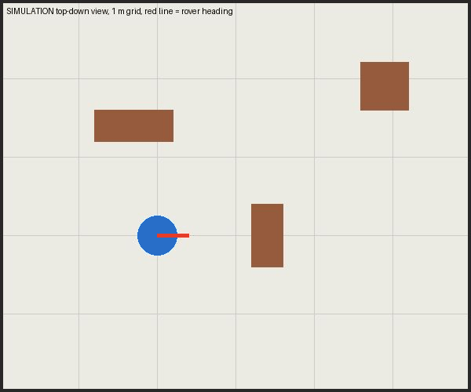
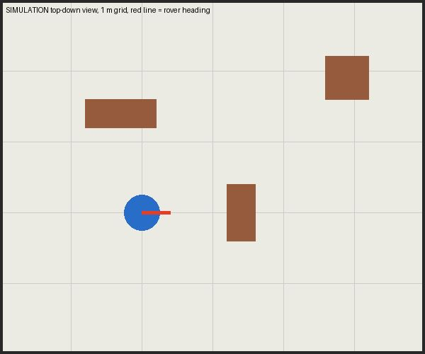
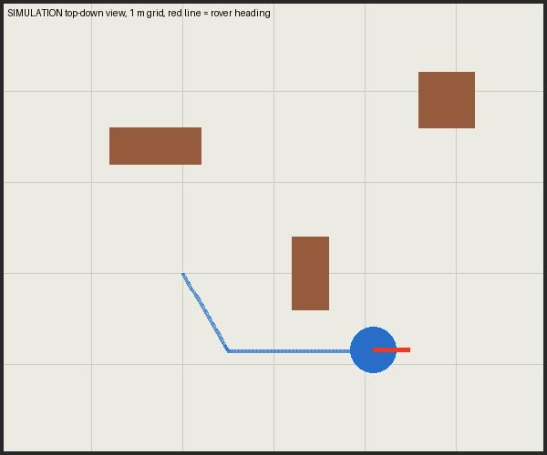
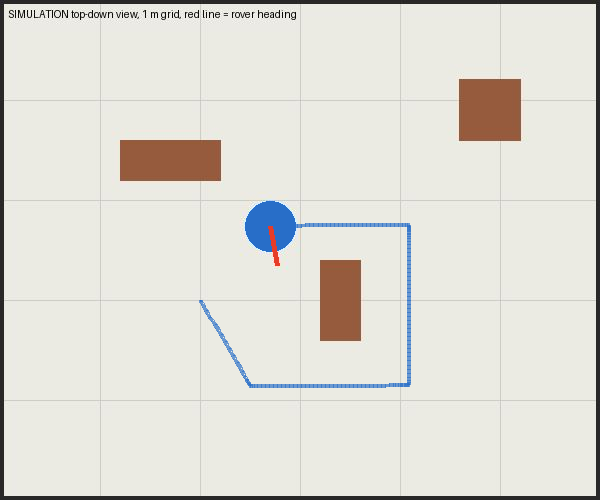
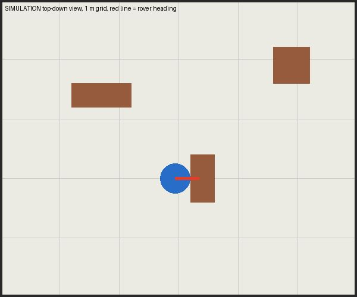

<div align="center">

# 🤖 leo-rover-mcp

**Let an AI agent drive a [Leo Rover](https://www.leorover.tech/) — safely, with a camera in the loop, and with a built-in simulator.**




<sub>The simulator: the rover (blue) follows a route through a 6 × 5 m room; the blue line is its odometry trail.</sub>

</div>

## About

`leo-rover-mcp` is an [MCP](https://modelcontextprotocol.io) server that exposes a Leo Rover as a handful of tools
(`rover_move`, `rover_turn`, `rover_camera`, …) to any MCP client — Claude Code, Claude Desktop and others.
It talks to the rover over **rosbridge** (`ws://10.0.0.1:9090`), the same websocket the stock `leo_ui` uses, so
nothing has to be installed on the rover and ROS is **not** needed on your computer.

A safety layer (speed limits, stall detection, watchdog) sits between the agent and the wheels, and a **simulator**
lets you try the whole loop — look, decide, move — without any hardware.

## Screenshots

In simulation mode `rover_camera` returns a top-down map instead of a photo. This is what the agent sees.

| 1. Start | 2. Mid-route |
|:---:|:---:|
|  |  |
| Rover at the origin, a box directly ahead. | Driving around the box; the trail is the odometry path. |

| 3. Route finished | 4. Stall detection |
|:---:|:---:|
|  |  |
| Nine closed-loop moves and turns, all `done`. | Driving into a box ends with `outcome: "stalled"`. |

Regenerate them with `.venv/bin/python scripts/make_screenshots.py`.

**AI agents:** read [AGENTS.md](AGENTS.md) — the operating manual for driving the rover through this server.

## Tools

| Tool | What it does |
|---|---|
| `rover_info` | limits, frames, configuration, which mode `rover_connect()` defaults to (no motion) |
| `rover_connect(simulate?, url?)` | connect to rosbridge (or the simulator) and wait for odometry |
| `rover_status` | odometry pose, velocity, battery voltage, tilt, data age, last motion, warnings |
| `rover_camera(topic?)` | one camera frame (JPEG, max 640 px wide) plus status — how the agent "sees" |
| `rover_move(distance_m, speed_m_s?)` | drive straight by a distance (negative = backwards), closed loop, holds heading |
| `rover_turn(angle_deg, speed_deg_s?)` | turn in place (positive = left), up to 360° |
| `rover_drive(linear_m_s, angular_deg_s, duration_s)` | hold a velocity for a time (arcs), open loop |
| `rover_stop` | stop immediately, interrupts a running motion |
| `rover_reset_odometry` | current pose becomes (0, 0, 0°) |
| `rover_list_topics(contains?)` | list ROS topics (diagnostics) |
| `rover_disconnect` | stop and disconnect |

Every tool returns `{"ok": true, ...}` or `{"ok": false, "error": "..."}`. Motions block until finished and
report an `outcome`: `done`, `stalled`, `stopped`, `timeout` or `aborted`.

## Safety

* `cmd_vel` is re-sent every 100 ms and the Leo firmware stops the wheels 0.5 s after the last command, so if the
  server dies or Wi-Fi drops, the rover stops by itself. Every motion ends with zero velocity.
* Limits (configurable): 0.4 m/s, 57°/s, max 3 m per `rover_move`, max 10 s per `rover_drive`. Non-finite
  arguments (NaN, inf) are refused.
* Motion is refused with stale odometry, battery below 10.4 V, or tilt above 30°.
* **Stall detection:** if motion is commanded but odometry shows no movement for 1.5 s, the motion ends with
  `stalled`. This catches blocked wheels, **not** wheels spinning in place (wheel odometry still "moves").
* Every closed-loop motion has a timeout; a lost connection aborts the motion.
* The rover has **no obstacle sensors**. Its only eyes are the forward-facing camera. There is no protection
  against stairs or edges.

## Install

Requires Python ≥ 3.10.

```bash
git clone https://github.com/Pandoxo/leo-rover-mcp.git
cd leo-rover-mcp
python -m venv .venv && .venv/bin/pip install -e ".[test]"      # or: uv venv && uv pip install -e ".[test]"
.venv/bin/python -m pytest -q                                   # 17 tests, ~70 s, no hardware needed
```

If you have packages in `~/.local` that clash with the venv, prefix commands with `PYTHONNOUSERSITE=1`.

### Register with Claude Code

Start in simulator mode (safe default):

```bash
claude mcp add -s user leo-rover -e LEO_DRY_RUN=1 -e LEO_URL=ws://10.0.0.1:9090 \
  -- "$(pwd)/.venv/bin/leo-rover-mcp"
```

With `LEO_DRY_RUN=1`, `rover_connect()` opens the **simulator** (a 6 × 5 m room with three boxes; the "camera" is
a top-down map). The real rover is reached with `rover_connect(simulate=false)`, or register with
`LEO_DRY_RUN=0` to make it the default.

Other MCP clients (Claude Desktop etc.) use the equivalent JSON:

```json
{
  "mcpServers": {
    "leo-rover": {
      "command": "/path/to/leo-rover-mcp/.venv/bin/leo-rover-mcp",
      "env": { "LEO_DRY_RUN": "1", "LEO_URL": "ws://10.0.0.1:9090" }
    }
  }
}
```

`python -m leo_rover_mcp` also starts the server (stdio transport).

### Connecting to the real rover

1. Join the rover's Wi-Fi (`LeoRover-XXXX`); the rover is at `10.0.0.1`. If the rover is on your own network,
   set `LEO_URL=ws://<rover-ip>:9090` (or pass `url` to `rover_connect`).
2. Open `http://10.0.0.1` (leo_ui) in a browser. If the joystick drives the rover, rosbridge works and so will
   this server.
3. If the rover runs in a ROS namespace, set `LEO_NAMESPACE`.
4. If `rover_connect` reports no odometry, run `rover_list_topics` (or `ros2 topic list` on the rover) and set
   `LEO_ODOM_TOPIC` / `LEO_NAMESPACE` accordingly.

## Configuration (environment variables)

| Variable | Default | |
|---|---|---|
| `LEO_URL` | `ws://10.0.0.1:9090` | rosbridge address |
| `LEO_DRY_RUN` | `0` | `1`: `rover_connect()` uses the simulator unless told otherwise |
| `LEO_NAMESPACE` | empty | ROS namespace of the rover |
| `LEO_CONNECT_TIMEOUT` | `5` s | websocket connect timeout |
| `LEO_CMD_VEL_TOPIC` | `cmd_vel` | |
| `LEO_ODOM_TOPIC` | `merged_odom,wheel_odom` | comma list; the first one that publishes is used |
| `LEO_IMU_TOPIC` | `imu/data` | needs an orientation estimate (for tilt) |
| `LEO_BATTERY_TOPIC` | `firmware/battery_averaged` | |
| `LEO_CAMERA_TOPIC` | auto | e.g. `camera/image_color/compressed`; auto = discover via `rosapi` |
| `LEO_MAX_LINEAR` / `LEO_DEFAULT_LINEAR` | `0.4` / `0.2` m/s | |
| `LEO_MAX_ANGULAR` / `LEO_DEFAULT_ANGULAR` | `1.0` / `0.6` rad/s | tools take deg/s; these are rad/s |
| `LEO_MAX_DISTANCE`, `LEO_MAX_DURATION` | `3` m, `10` s | per call |
| `LEO_BATTERY_MIN`, `LEO_BATTERY_WARN` | `10.4` V, `11.0` V | refuse motion / warn |
| `LEO_TILT_MAX`, `LEO_STALL_TIME` | `30`°, `1.5` s | |
| `LEO_IMAGE_WIDTH` | `640` | image width sent to the model |

All topic names are relative to `LEO_NAMESPACE`.

## Layout

* `leo_rover_mcp/rosbridge.py` — minimal rosbridge v2 client (asyncio + websockets)
* `leo_rover_mcp/backend.py` — Leo backend: topics, odometry, battery, IMU, camera, services
* `leo_rover_mcp/sim.py` — simulator (firmware-like acceleration limits and command timeout, box collisions)
* `leo_rover_mcp/rover.py` — motion control and all safety checks
* `leo_rover_mcp/mcp_server.py` — MCP tools and the instructions sent to the agent
* `leo_rover_mcp/config.py` — settings
* `tests/` — simulator tests, a fake rosbridge server, and a full MCP client session
